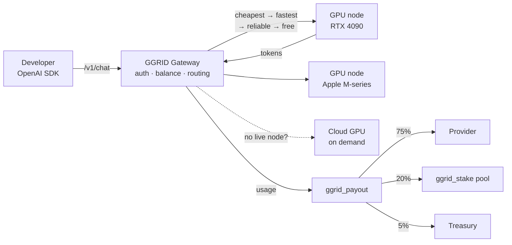

<div align="center">

# GGRID

### Decentralized GPU inference, OpenAI-compatible, settled on Solana

**Point your OpenAI SDK at one URL and run open models on a global grid of community GPUs.**
Providers plug in idle hardware and get paid per token, on-chain, in `$GGRID`.

[](https://gpugrid.app)
[](#drop-in-for-openai)
[](#on-chain)
[](#on-chain)
[](#for-providers)
[](#for-providers)

</div>

---

GGRID is an inference network with three sides and one idea: **compute should be a market, not a monopoly.** Developers call a standard OpenAI-compatible endpoint and pay per token. Providers run a light agent on their GPU and earn `$GGRID` for the tokens they generate. Every job is priced, routed, and settled automatically, with the money split on-chain by a verified Solana program, so nobody sends an invoice and nobody waits for a payout.

If your code already talks to OpenAI, it already talks to GGRID. Change one line, the `base_url`, and you are running on the grid.

---

## Contents

- [Why GGRID exists](#why-ggrid-exists) - the three problems it solves
- [How it works](#how-it-works) - the pieces and the loop
- [Quick start](#quick-start) - from zero to a first token
- [Drop-in for OpenAI](#drop-in-for-openai) - endpoints and examples
- [Models and pricing](#models-and-pricing) - catalog and rates
- [Routing and reliability](#routing-and-reliability) - how a node is chosen
- [For providers](#for-providers) - turn a GPU into income
- [Token economics](#token-economics) - the fee split
- [Staking](#staking) - earn from the whole network
- [On-chain](#on-chain) - the programs
- [FAQ](#faq)
- [Links](#links)

---

## Why GGRID exists

Three costs get paid on every AI product. GGRID exists to cut all three.

**1. Idle silicon.** The world is full of GPUs that sit dark most of the day - gaming rigs, workstations, a spare 4090, an Apple Silicon Mac. Meanwhile developers rent the same class of hardware from a handful of clouds at a markup. *GGRID fix:* a provider registers a machine in minutes and it starts earning for the exact tokens it produces, no data-center contract required.

**2. Vendor lock-in.** Building on a single closed API means one price sheet, one rate limit, one outage, one terms-of-service change away from a rewrite. *GGRID fix:* it is the OpenAI API surface exactly, backed by open models on many independent machines. Your integration does not change; what runs it becomes a competitive market.

**3. Opaque payouts.** In most networks the operator holds the money and promises to pay contributors later. *GGRID fix:* settlement is an on-chain program. The moment a job finishes, its fee is split and paid to the provider, the staking pool, and treasury in a single transaction that anyone can audit.

The throughline: **an OpenAI-shaped front door, an open market behind it, and trustless money underneath.**

---

## How it works

Four parts, one closed loop:

```
   DEVELOPER                 GATEWAY                     GRID
  ┌───────────┐        ┌───────────────────┐      ┌──────────────┐
  │ OpenAI    │  POST  │  auth + balance   │ pick │  GPU node    │
  │ SDK / curl│ ─────► │  price + route    │ ───► │  RTX 4090    │
  └───────────┘        │  failover + queue │      ├──────────────┤
        ▲              └─────────┬─────────┘      │  Apple M-ser │
        │  tokens                │                 ├──────────────┤
        └────────────────────────┘   cloud fallback│  on demand   │
                                 │                 └──────────────┘
                                 ▼ usage
                        ┌───────────────────┐
                        │  ggrid_payout     │  75% provider
                        │  (Solana)         │  20% stakers ─► ggrid_stake
                        └───────────────────┘   5% treasury
```



| Part | Role |
| --- | --- |
| **Gateway** | The single OpenAI-compatible entry point. Authenticates the key, checks balance, prices the job, routes it, handles failover and the capacity queue, and bills on completion. |
| **Nodes** | Provider machines running Ollama behind a light agent. Each advertises the models it serves and heartbeats to stay online. Two tiers: CUDA and Apple Metal. |
| **Router** | Chooses the best live node for a model: cheapest, then fastest, then most reliable, then least busy. Handles retries and the queue. |
| **Chain** | `ggrid_payout` splits and settles every job; `ggrid_stake` pays stakers their cut. Verified programs on Solana mainnet. |

---

## Quick start

**1. Get a key.** Sign in at [gpugrid.app](https://gpugrid.app), create an API key, and top up your balance (new accounts start with free trial credits).

**2. See what is online:**

```bash
curl https://gpugrid.app/v1/models \
  -H "Authorization: Bearer ggrid_your_key"
```

**3. Send your first request:**

```bash
curl https://gpugrid.app/v1/chat/completions \
  -H "Authorization: Bearer ggrid_your_key" \
  -H "Content-Type: application/json" \
  -d '{
    "model": "llama3.1:8b",
    "messages": [{"role": "user", "content": "Say hi in one line."}]
  }'
```

That is it. Everything below is detail.

---

## Drop-in for OpenAI

Set two fields on the official SDK and every existing tool, framework, and agent keeps working.

**Python**

```python
from openai import OpenAI

client = OpenAI(
    base_url="https://gpugrid.app/v1",
    api_key="ggrid_your_key",
)

resp = client.chat.completions.create(
    model="llama3.1:8b",
    messages=[{"role": "user", "content": "Explain GPU memory bandwidth in one paragraph."}],
    stream=True,
)
for chunk in resp:
    print(chunk.choices[0].delta.content or "", end="")
```

**Node / TypeScript**

```ts
import OpenAI from "openai";

const client = new OpenAI({
  baseURL: "https://gpugrid.app/v1",
  apiKey: "ggrid_your_key",
});

const resp = await client.chat.completions.create({
  model: "qwen2.5:7b",
  messages: [{ role: "user", content: "One-sentence pitch for decentralized GPUs." }],
});
console.log(resp.choices[0].message.content);
```

**Endpoints**

| Method | Path | What it does |
| --- | --- | --- |
| `POST` | `/v1/chat/completions` | Chat completions, streaming (SSE) or not, fully OpenAI-shaped |
| `POST` | `/v1/embeddings` | Vector embeddings |
| `GET` | `/v1/models` | Live catalog: every model currently online on the grid, merged with the known price list |

**Headers**

| Header | Purpose |
| --- | --- |
| `Authorization: Bearer <key>` | Your API key. Required. |
| `x-ggrid-node: <node_id>` | Optional. Pin the request to one specific GPU (the marketplace mode). No auto-fallback: your choice is honored exactly. |

---

## Models and pricing

The network is **model-agnostic**: anything a provider pulls in Ollama becomes available. Popular models have a published rate; anything else falls back to a flat default. Prices are per 1,000,000 tokens.

Billing unit: **`1 credit = 1 micro-USD`** (one millionth of a dollar), so a typical request costs a small fraction of a cent and the fee split still divides cleanly.

| Model | Class | Input / 1M | Output / 1M |
| --- | --- | --- | --- |
| `llama3:8b` | 8B | $0.05 | $0.15 |
| `llama3.1:8b` | 8B | $0.05 | $0.15 |
| `qwen2.5:7b` | 7B | $0.05 | $0.15 |
| `mistral:7b` | 7B | $0.05 | $0.15 |
| `gemma2:9b` | 9B | $0.06 | $0.18 |
| `llama3:70b` | 70B | $0.30 | $0.90 |
| *any other model* | fallback | $0.10 | $0.30 |

Top up by depositing `$GGRID` on-chain; the deposit is credited to your balance automatically.

---

## Routing and reliability

The router does the work so a single flaky machine never becomes your problem.

| Behavior | What happens |
| --- | --- |
| **Best-node pick** | Among live, verified nodes serving the model: cheapest price first, then fastest measured throughput, then most reliable, then least busy. |
| **Failover** | If a node dies at or before its first token, the request retries on the next node. The client never sees a broken stream. |
| **Capacity queue** | If every capable node is momentarily full, the request waits briefly for a slot instead of failing outright. |
| **Cloud fallback** | If nothing on the grid serves the model, a cloud GPU can be spun up on demand and torn down when idle (gated to paid usage). |
| **Reliability floor** | Nodes that fall below a trust threshold are quarantined out of routing automatically. |
| **Long-job steering** | Streaming or high-token jobs are routed toward actively-cooled machines, away from fanless laptops that throttle under sustained load. |
| **Node pinning** | Send `x-ggrid-node` to run on one exact GPU, turning the grid into a pick-your-machine marketplace. |

---

## For providers

Turn an idle GPU into a paid node in three steps.

**1. Install Ollama and pull a model**

```bash
# install ollama, then:
ollama pull llama3.1:8b
```

**2. Get your provider token**

Sign in to the provider console at [gpugrid.app](https://gpugrid.app) and copy your provider token.

**3. Run the GGRID agent**

```bash
ggrid-agent \
  --provider-token "prv_your_token" \
  --ollama http://localhost:11434 \
  --price-factor 1.0
```

The agent registers your node, reports which models you serve, opens a public tunnel, and heartbeats to stay online. Lower `--price-factor` to bid cheaper and win more jobs; raise it if your hardware is premium.

**Hardware tiers**

| Tier | Hardware | Verification | Serving |
| --- | --- | --- | --- |
| **CUDA** | NVIDIA GPUs (RTX 4090, etc.) | Auto-verified | Immediately |
| **Apple Metal** | Apple Silicon (M-series) | Measured benchmark gate | After passing |

GGRID **never trusts a self-declared chip.** A new Apple Metal node is probed for real tokens per second and for thermal throttling (a fanless MacBook Air slows under sustained inference); only nodes that clear the throughput floor start serving paid traffic.

**Node lifecycle**

| State | Meaning |
| --- | --- |
| `provisional` | Registered, benchmark in progress (Metal only). Not yet serving. |
| `verified` | Passed the gate. Live and eligible for routing. |
| `rejected` | Failed the throughput floor or declared an unsupported chip. |
| `quarantined` | Reliability dropped below the floor; held out of routing until it recovers. |

---

## Token economics

Every job's fee is split on-chain the instant it settles. No pool of held funds, no manual payout.

| Share | Recipient |
| --- | --- |
| **75%** | The provider who ran the job |
| **20%** | `$GGRID` stakers |
| **5%** | Treasury |

Because the split happens in the settlement transaction itself, the parts always sum to the exact fee charged, and every payout is on the public ledger.

---

## Staking

Stake `$GGRID` and earn a share of the **20% cut taken from every single job on the network.** The busier the grid, the more the pool earns, and rewards accrue continuously per staked token.

- **How rewards accrue:** an accumulator model (the same math class as MasterChef) tracks reward-per-token, so your share is proportional to how much and how long you stake.
- **You keep your keys:** `stake`, `unstake`, and `claim` are all signed by you. The gateway only reads the pool and hands your wallet an unsigned transaction to sign; it never holds your funds.
- **No coupling required:** the payout program pays the stakers' cut into a token account owned by the stake pool, so the two programs settle without touching each other.

---

## On-chain

Two Anchor programs, both deployed and verified on Solana mainnet, with reproducible builds so the bytecode on-chain matches this source.

| Program | Role |
| --- | --- |
| `ggrid_payout` | Splits every job fee (75 / 20 / 5) and pays provider, stake pool, and treasury in one transaction |
| `ggrid_stake` | Staking pool with per-token reward accrual; user-signed stake / unstake / claim |

| What | Address |
| --- | --- |
| Stake program | `DNScf1sutG7Aaq9KNjTejgJPyntTCXH1ntvY3K3LDekt` |

Both programs ship with a full Anchor test suite covering the accrual math and the fee split.

---

## FAQ

**Do I need to learn a new SDK?**
No. GGRID speaks the OpenAI API. Change `base_url` to `https://gpugrid.app/v1` and your existing code runs.

**Which models can I use?**
Any model a provider has pulled in Ollama - Llama 3 / 3.1, Qwen 2.5, Mistral, Gemma 2, and more. `GET /v1/models` returns what is live right now.

**How do I pay?**
In credits, topped up by depositing `$GGRID` on-chain. New accounts get free trial credits to start.

**Can I choose which GPU runs my request?**
Yes. Send the `x-ggrid-node` header with a node id to pin the request to that exact machine.

**What does staking earn?**
A proportional share of the 20% of every job fee that flows to the stake pool. More network throughput means more rewards.

**Is streaming supported?**
Yes, full SSE streaming, exactly like OpenAI. The gateway even reads the first token before committing to a node, so a dead machine fails over instead of handing you a broken stream.

---

## Links

- Live app: [gpugrid.app](https://gpugrid.app)

> `$GGRID` is a utility token for paying for and settling GPU compute on this network. Nothing here is financial advice.
